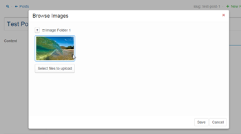

# Cloudinary Browser Usage and Behavior

The Cloudinary Browser is a TinyMCE plugin using React components and integrating tightly with Keystone.

[](//raw.githubusercontent.com/jeffreypriebe/keystone/integrated-insert-view-images/admin/public/js/lib/tinymce/plugins/cloudinarybrowser/docs/select-image-plugin.png)

## Goal
The Cloudinary Browser is intended to be a simple folder browser that:
 1. Uses existing React components in KeystoneJS for 'folder content.'
 2. Works with Keystone Lists to manage content seamlessly. (Each Item in a Keystone list becomes a 'folder' in the browser.)

The expected setup is two have two cloudinary browser instances: one for images and one for files.

# Contents

 1. [Setup](#setup)
 2. [Folder Item Child Componenet Interface](#folder-item-child-componenet-interface)
 3. [Pre-requisites](#pre-requisites)
 4. [Keystone Core Inclusion](#keystone-core-inclusion)

## Setup

Two items of setup are required to use the Cloudinary Browser:
 1. Inclusion in the TinyMCE setup. (Buttons & plugins.)
 2. Configuartion information for the cloud services used (Cloudinary for Images, Amazon S3 for Files).
 3. Configuration information for which Keystone Lists will 'back' the plugin (where to store the data).

All of these items are configured in the `keystone.init` call of the `keystone.js` file.

#### 1. TinyMCE Setup
The TinyMCE setup is standard, simply add the cloudinarybrowserfiles and cloudinarybrowserimages (the two aliases for the cloudinary browser plugin) to both the list of plugins and the list of buttons in the `keystone.init` configuration object:

```
keystone.init({
  'wysiwyg additional buttons': 'cloudinarybrowserfiles cloudinarybrowserimages',
  'wysiwyg additional plugins': 'cloudinarybrowserfiles, cloudinarybrowserimages',
```

#### 2. Cloud Service Configuration
Cloud service configuration is standard for all shared mechanisms of Keystone, see other documentation for Cloudinary and Amazon S3 configuration.

#### 3. Keystone Configuration
The Cloudinary Browser uses Keystone Lists for all its storage, so it needs to be configured. As additional configuration to the `keystone.init` call:

```
'wysiwyg additional options': {
	'cloudinarybrowserimages': {
		'modelName': 'image-folders', //pluralized, lower-case, it's the list.plural property value
		'fieldName': 'images'
		},
	'cloudinarybrowserfiles': {
		'modelName': 'file-folders',
		'fieldName': 'files'
	}
},
```

What is going on here?

The `wysiwyg additional options` simply passes this information straight through to the plugin. It is accesible by name, so the 'cloudinarybrowserimages' object is visible by the 'cloudinarybrowserimages' plugin (similarly with the -files).

There are two parts to the configuration:
 1. `modelName`
 2. `fieldName`

This is the `modelName` of the Keystone List, pluralized and lower case. In this case, `'images-folders'` is to the following model:
```
var ImageFolder = new keystone.List('ImageFolder', { ... });

ImageFolder.add({
	name: { type: String, required: true },
	images: {
		type: Types.CloudinaryImages,
		autoCleanup: true
	}
});
```
This leads to the `'fieldName'` which matches the specific field from which to read the browsable objects.

To clarify, these Lists referenced are not the List where the plugin (inside an `HtmlField`) is being displayed. In the example a different Keystone List is displaying the plugin that will then integrate with this `ImageFolder` model. 

Note: Since each Item in a Keystone List (each ImageFolder Item in the Image Folder List) is a 'folder' in the plugin, the field is expected to be a 'multiple' type. Here, the CloudinaryImages; not singular 'CloudinaryImage.'
Similarly with the Amazon S3 Files, it should be the plural 'S3Files' not the singular 'S3File' type.

## Folder Item Child Componenet Interface
The plugin uses the 'CloudinaryImagesField' for images and the 'S3FilesField' for files. These are used to display the contents of any 'folder' (Keystone Item).

As such, they must interface with the browser component. The following behaviors are expected:
 1. `componentDidUpdate` should be implemented to handle the loading of items (images or files).
 2. `props.cb` will have as a value, a callback function to communicate state updates to be persisted (e.g. files to upload, etc.).
 3. On upload of a file, values from `window.FileReader.readAsDataUrl` are necessary.
 4. Provide a `markUploaded` function that accepts an index in the current items to mark it as 'upload completed.'
 5. Handle `props.canUpload` being set and display the 'upload' UI accordingly (some folders won't provide for uploading).
 6. Handle `props.allowRemoval` being set and display 'remove' or 'delete' UI accordingly. (For simplicity, cloudinary browser isn't equipped to allow removals [they can be handled via the default Keystone List behavior].)
 7. On selection of an item, call the function `props.imageClick`.

The easiest way to understand these would be to review either existing implementation: `CloudinaryImagesField.js` or `S3FilesField.js`.

Note: while not a requirement for child components, any `Type` of a child component must accept POSTing of files in the body in order for uploading to work, see below. 

## Pre-requisites
As a read may notice, there are many action supporting the described approach that currently don't form part of KeystoneJS. These pre-requisite behaviors were added to enable the above plugin setup.

 1. React-based TinyMCE plugins.
 
 There is no default inclusion of React in TinyMCE plugins. To support the usage of React components (and re-use of existing Keystone Fields), this was added. This comprises several moving parts:
  1. Inclusion of TinyMCE plugin in the routing of `admin/app/static.js`. (Bundled and minified - less files are also handled.)
    
     Any files named `'renderPlugin.js'` in a plugin folder of TinyMCE (`admin/public/js/lib/tinymce/plugins/`) will be browserified and served on the `/js/tiny-mce-plugins/` path.
	 Any files named `'plugin.js'` will be minified and served in place.
   
  2. The TinyMCE plugin launches a url on a new route that include the necessary React inclusion.
  
     New routes of `/keystone/tiny-mce-plugin/:plugin` use `templates/views/tiny-mce-plugin.jade` and `admin/routes/views/tiny-mce-plugin.js` to deliver the contents of `renderPlugin.js`.
 
 2. Accepting Keystone Items POSTing of files. 
    
	The Keystone Item API only includes delete and get. This could have been expanded to handle POST and PUT for the created and update behaviors needed.
	For simplicity, the existing Keystone Item routing was reused.
	This required two changes:
	1. `admin/routes/views/item.js` will also set a status of 403 for invalid CSRF. (This helps with the programmatic uploading, but is probably the right action regardless.)   
	2. Support of POSTing of files in body content as base64 encoded string.
	
	   In the `getRequestHandler` method for the field that is being used, it must support passing of file data in `res.body` (in addition to the standard `res.files`) as JSON-encoded base64 encoded string. 
	   So, in this case, the [CloudinaryImages was modified to handle this](https://github.com/jeffreypriebe/keystone/commit/28e4f01f0bbce30b5dd15fc75eefd5ba91876aad). 
	
 3. Amazon S3Files - plural.
 
    Keystone only has a field for an individual, single Amazon S3File. A new Type was created for multiple files.

 4. Elemental for styling
    
	This is not strictly necessary. To style the folder browser nicely, it seemed wise to use the forthcoming Elemental styles.
	These were included as an npm package and referenced (in `admin/app/static.js` at the `'/styles/elemental/'` route) from their node_modules location - in order to faciliate easier removal in the future once Elemental is included in Keystone by default.
	Note: Images from Elemental are at the `'/public/images/'` route.

## Keystone Core Inclusion
It seems unlikely that this work will be a good fit for inclusion into the Keystone core anytime soon. At the very least it would need to be cleaned up and made more generic for usage. It is not being submitted for inclusion at this time.

More likely is that plugins will be added to Keystone and this work will be available in that way. 
